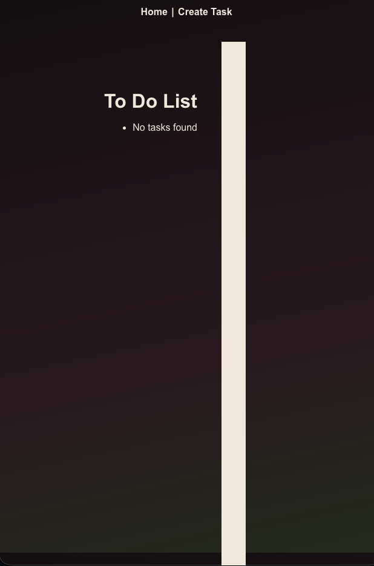
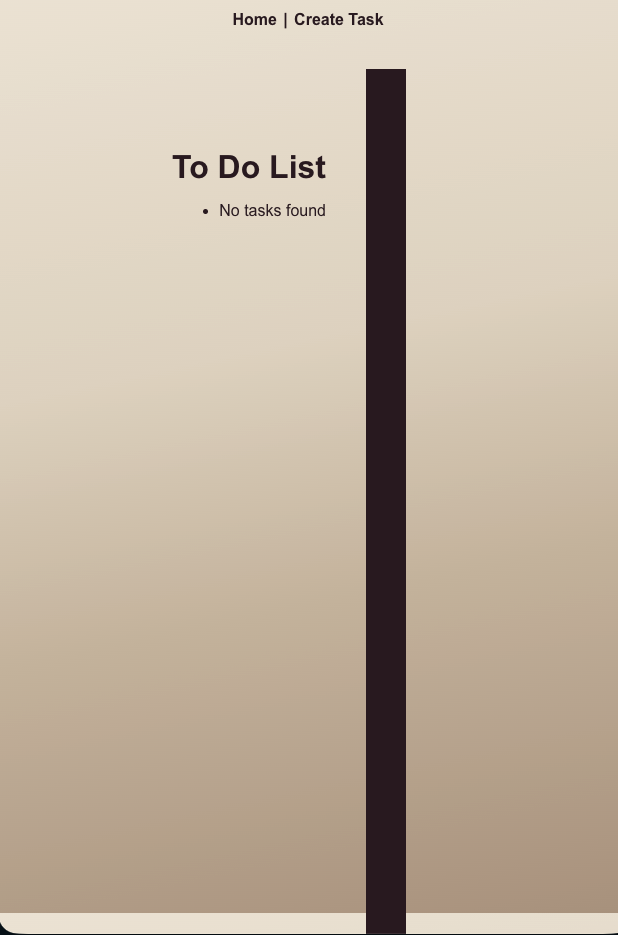

# What Todo

A simple, stylish CRUD tasks app built with Next.js. Moody gothic neutrals meet clean functionality, because you deserve an app that acknowledges the work you have Todo.

**Live:** [what-todo-topaz.vercel.app](https://what-todo-topaz.vercel.app)




## Features

- **Create** tasks from a dedicated task creation page
- **Edit** existing tasks with pre-populated input fields
- **Delete** tasks with confirmation prompt
- **Dark & Light Mode** — automatically adapts to your system preferences
- **Responsive** layout that works across devices

> **Note:** Tasks are stored in memory and do not persist once the browser is closed or the server restarts.

## Getting Started

### Prerequisites

- Node.js (v18+)
- npm, yarn, pnpm, or bun

### Installation

```bash
git clone https://github.com/SneauxGirl/what-todo.git
cd what-todo
npm install
```

### Run Locally

```bash
npm run dev
```

Open [http://localhost:3000](http://localhost:3000) to see the app.

## Deployment

This app is deployed on [Vercel](https://vercel.com/). If deploying your own instance, add the following environment variable in your Vercel project settings:

- **Key:** `NEXT_PUBLIC_API_URL`
- **Value:** Your live app URL (e.g., `https://your-app.vercel.app`)

Locally, the app falls back to `http://localhost:3000` automatically — no `.env` file needed.

## Built With

- [Next.js](https://nextjs.org/) — React framework with App Router and API routes
- [CSS Modules](https://nextjs.org/docs/app/building-your-application/styling/css-modules) — Scoped component styling
- [Vercel](https://vercel.com/) — Deployment and hosting

## Always More Todo

This project is complete as-is. Here are some ideas for further development. If you implement one, let me know — I'll check it off and link to your project!

- [ ] **Task completion** — Mark tasks as done without deleting them
- [ ] **Persistent storage** — Client-side cookies or database integration so tasks survive a refresh
- [ ] **Categories** — Group tasks by context (work, personal, errands, etc.)
- [ ] **Priority levels** — Highlight high-priority tasks and auto-sort them to the top
- [ ] **Smart reordering** — When a task is completed, the next highest priority moves up and gets highlighted automatically
- [ ] **Sort options** — Toggle between original order, priority, or category-by-priority views
